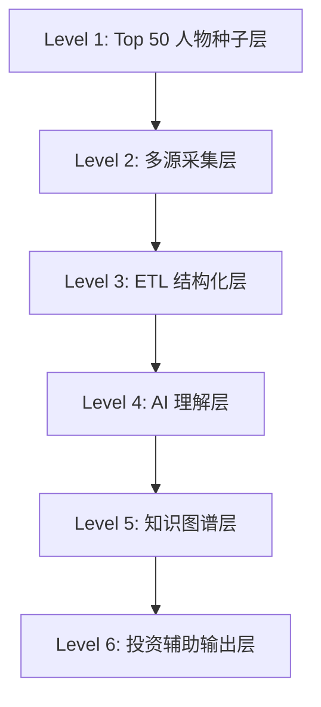
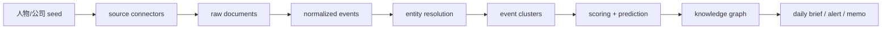

# 系统架构

## 顶层目标

围绕硅谷 AI Top 50 关键人物构建持续情报系统，将分散的弱结构化信号转化为可用于投资辅助决策的结构化洞察。

## 六层架构

## 数据流

## 模块拆分

### 1. Seed Registry

- 维护 Top 50 人物主表
- 维护人物与公司、历史任职、渠道标识的映射

### 2. Source Connectors

- X/Twitter
- News/RSS
- GitHub
- YouTube/Podcast transcript
- Company blog / hiring pages

### 3. ETL Pipeline

- 去重
- 去噪
- 实体识别
- 关系抽取
- 时间归一化
- 事件聚类

### 4. Intel Reasoning

- 事件分类
- 风险评分
- 机会评分
- 趋势预测
- 动机推断

### 5. Knowledge Graph

- 人物、公司、模型、论文、事件、趋势、议题之间的关系组织

### 6. Delivery Layer

- 日报
- 预警
- 深度研究 memo
- watchlist 影响摘要

## MVP 策略

- 第一阶段只保留 3 个高信号源：`X/Twitter`、新闻/RSS、GitHub
- 第一阶段只保留 5 类强事件：`model_release`、`funding`、`partnership`、`talent_movement`、`policy_statement`
- 第一阶段先用关系表 + 聚合查询模拟图谱能力

## 关键设计原则

- 以“事件”为一等公民，不以网页为一等公民
- 先做结构化和证据链，再做预测
- 事实层和推断层分离存储
- 任何预测结论必须能回溯到 source 和 event cluster
