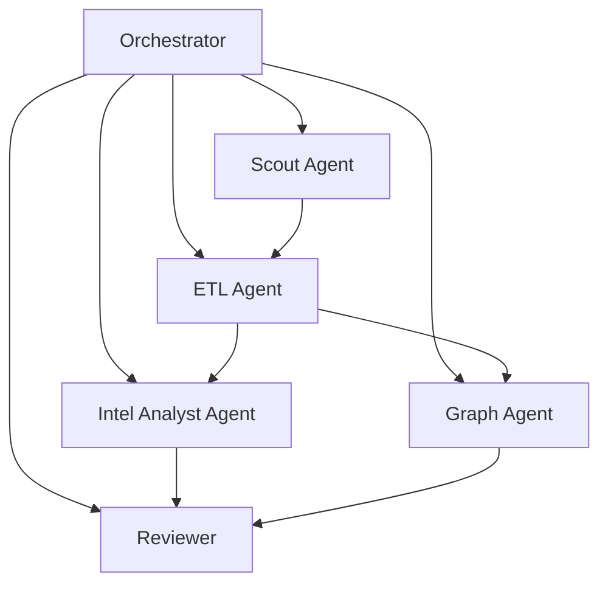

# Agent 拓扑

## 设计目标

- 把“多 Agent”用在明确分工和上下文隔离上，而不是让多个大模型无序并发
- 每个 Agent 负责稳定产物，而不是只给意见
- 通过流程卡控制 handoff，而不是让 Agent 自行发散

## 角色拓扑

## 角色职责

### Orchestrator

- 接收项目目标和当前阶段
- 选择下一张流程卡
- 判断哪些任务可并行
- 汇总阶段性结果

### Scout Agent

- 维护 source catalog
- 管理 seed person 的渠道映射
- 拉取原始文档或事件线索

### ETL Agent

- 清洗原始文本
- 去重、去噪、NER、RE、聚类
- 生成 `events`、`event_clusters` 和候选关系

### Intel Analyst Agent

- 事件分类
- 风险与机会评分
- 趋势预测
- 生成日报和 memo 草稿

### Graph Agent

- 做实体对齐
- 维护 `entity_relationships`
- 构建人物、公司、模型与事件的可查询关系图

### Reviewer

- 验证数据质量
- 验证预测是否可回溯
- 验证输出是否可被投资研究员消费

## 协作原则

- 原始 source 不直接进入报告层，必须先过 ETL
- 预测不直接覆盖事实层，必须单独落到 `predictions`
- 任何高风险结论都要带 evidence event 或 cluster

## 第一阶段最小并行

- Scout Agent：整理 50 人 seed 和 3 类高信号源
- ETL Agent：定义事件 schema 和去重规则
- Intel Analyst Agent：定义分类体系、评分体系和日报模板

## 第一阶段暂停事项

- 不做复杂 multi-hop autonomous delegation
- 不做图数据库高复杂实时同步
- 不做全自动交易动作
